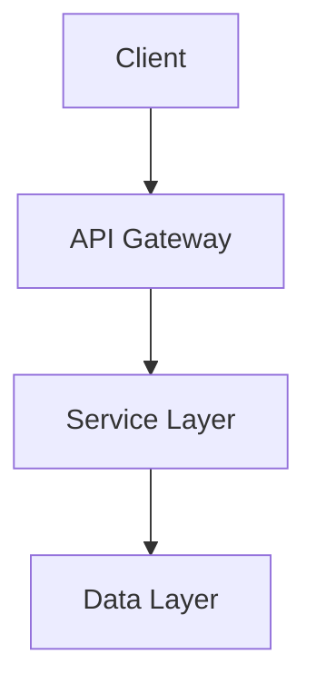
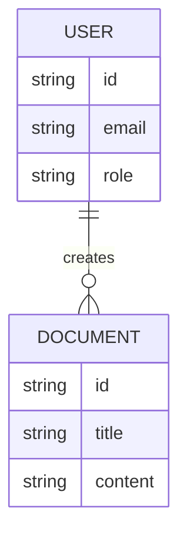

# Spec-Kit: Constitution-Based Spec-Driven Development

Official GitHub Spec-Kit integration providing a 7-phase constitution-driven workflow for feature development.

## Quick Start

This skill works with the [GitHub Spec-Kit CLI](https://github.com/github/spec-kit) to guide you through structured feature development:

1. **Constitution** → Establish governing principles
2. **Specify** → Define functional requirements
3. **Clarify** → Resolve ambiguities
4. **Plan** → Create technical strategy
5. **Tasks** → Generate actionable breakdown
6. **Analyze** → Validate consistency
7. **Implement** → Execute implementation

**Storage**: Creates files in `.specify/specs/NNN-feature-name/` directory with numbered features

## When to Use

- Setting up spec-kit in a project
- Creating constitution-based feature specifications
- Working with .specify/ directory
- Following GitHub spec-kit workflow
- Constitution-driven development

---

## Prerequisites & Setup

### Check CLI Installation

First, verify if spec-kit CLI is installed:

```bash
command -v specify || echo "Not installed"
```

### Installation

If not installed:

```bash
# Persistent installation (recommended)
uv tool install specify-cli --from git+https://github.com/github/spec-kit.git

# One-time usage
uvx --from git+https://github.com/github/spec-kit.git specify init <PROJECT_NAME>
```

**Requirements**:
- Python 3.11+
- Git
- uv package manager ([install uv](https://docs.astral.sh/uv/))

### Project Initialization

If CLI is installed but project not initialized:

```bash
# Initialize in current directory
specify init . --ai claude

# Initialize new project
specify init <project-name> --ai claude

# Options:
# --force: Overwrite non-empty directories
# --script ps: Generate PowerShell scripts (Windows)
# --no-git: Skip Git initialization
```

---

<details>
<summary>🔍 Phase Detection Logic</summary>

## Detecting Project State

Before proceeding, always detect the current state:

### 1. CLI Installed?

```bash
if command -v specify &> /dev/null || [ -x "$HOME/.local/bin/specify" ]; then
  echo "CLI installed"
else
  echo "CLI not installed - guide user through installation"
fi
```

### 2. Project Initialized?

```bash
if [ -d ".specify" ] && [ -f ".specify/memory/constitution.md" ]; then
  echo "Project initialized"
else
  echo "Project not initialized - guide user through 'specify init'"
fi
```

### 3. Current Feature

```bash
# Get latest feature directory
LATEST=$(ls -d .specify/specs/[0-9]* 2>/dev/null | sort -V | tail -1)
echo "Latest feature: $LATEST"
```

### 4. Current Phase

Detect phase by checking file existence in latest feature:

```bash
FEATURE_DIR=".specify/specs/001-feature-name"

if [ ! -f ".specify/memory/constitution.md" ]; then
  echo "Phase: constitution"
elif [ ! -d "$FEATURE_DIR" ]; then
  echo "Phase: specify"
elif [ -f "$FEATURE_DIR/spec.md" ] && ! grep -q "## Clarifications" "$FEATURE_DIR/spec.md"; then
  echo "Phase: clarify"
elif [ ! -f "$FEATURE_DIR/plan.md" ]; then
  echo "Phase: plan"
elif [ ! -f "$FEATURE_DIR/tasks.md" ]; then
  echo "Phase: tasks"
elif [ -f "$FEATURE_DIR/tasks.md" ] && grep -q "\\- \\[ \\]" "$FEATURE_DIR/tasks.md"; then
  echo "Phase: implement"
else
  echo "Phase: complete"
fi
```

</details>

<details>
<summary>📜 Phase 1: Constitution</summary>

## Constitution Phase

Establish foundational principles that govern all development decisions.

### Purpose

Create `.specify/memory/constitution.md` with:
- Project values and principles
- Technical standards
- Decision-making frameworks
- Code quality expectations
- Architecture guidelines

### Process

1. **Gather Context**
   - Understand project domain
   - Identify key stakeholders
   - Review existing standards (if any)

2. **Draft Constitution**
   - Core values and principles
   - Technical standards
   - Quality expectations
   - Decision criteria

3. **Structure**

```markdown
# Project Constitution

## Core Values

1. **[Value Name]**: [Description and implications]
2. **[Value Name]**: [Description and implications]

## Technical Principles

### Architecture
- [Principle with rationale]

### Code Quality
- [Standards and expectations]

### Performance
- [Performance criteria]

## Decision Framework

When making technical decisions, consider:
1. [Criterion with priority]
2. [Criterion with priority]
```

4. **Versioning**
   - Constitution can evolve
   - Track changes for governance
   - Review periodically

### Example Content

```markdown
# Project Constitution

## Core Values

1. **Simplicity Over Cleverness**: Favor straightforward solutions that are easy to understand and maintain over clever optimizations.

2. **User Experience First**: Every technical decision should improve or maintain user experience.

## Technical Principles

### Architecture
- Prefer composition over inheritance
- Keep components loosely coupled
- Design for testability

### Code Quality
- Code reviews required for all changes
- Unit test coverage > 80%
- Documentation for public APIs

### Performance
- Page load < 3 seconds
- API response < 200ms
- Progressive enhancement for slower connections

## Decision Framework

When choosing between approaches:
1. Does it align with our core values?
2. Is it maintainable by the team?
3. Does it scale with our growth?
4. What's the long-term cost?
```

</details>

<details>
<summary>📝 Phase 2: Specify</summary>

## Specify Phase

Define *what* needs building and *why*, avoiding technology specifics.

### Script Usage

```bash
# Create new feature
.specify/scripts/bash/create-new-feature.sh --json "feature-name"

# Expected JSON output:
# {"BRANCH_NAME": "001-feature-name", "SPEC_FILE": "/path/to/.specify/specs/001-feature-name/spec.md"}
```

**Parse JSON**: Extract `BRANCH_NAME` and `SPEC_FILE` for subsequent operations.

### Template Structure

Load `.specify/templates/spec-template.md` to understand required sections, then create specification at `SPEC_FILE` location.

### Specification Content

Focus on **functional requirements**:

```markdown
# Feature Specification: [Feature Name]

## Problem Statement

[What problem are we solving?]

## User Stories

### Story 1: [Title]

As a [role]
I want [capability]
So that [benefit]

**Acceptance Criteria:**
- [ ] [Specific, testable criterion]
- [ ] [Specific, testable criterion]

### Story 2: [Title]

[Continue...]

## Non-Functional Requirements

- Performance: [Specific metrics]
- Security: [Requirements]
- Accessibility: [Standards]
- Scalability: [Expectations]

## Success Metrics

- [Measurable outcome]
- [Measurable outcome]

## Out of Scope

[Explicitly state what's NOT included]
```

### Key Principles

- **Technology-agnostic**: Don't specify "use React" or "MySQL"
- **Outcome-focused**: Describe what user achieves, not how
- **Testable**: Acceptance criteria must be verifiable
- **Complete**: Address edge cases and error scenarios

### Git Integration

The script automatically:
- Creates new feature branch (e.g., `001-feature-name`)
- Checks out the branch
- Initializes spec file

</details>

<details>
<summary>❓ Phase 3: Clarify</summary>

## Clarify Phase

Resolve underspecified areas through targeted questioning.

### Purpose

Before planning implementation, ensure specification is complete and unambiguous.

### Process

1. **Analyze Specification**
   - Read spec.md thoroughly
   - Identify ambiguities, gaps, assumptions
   - Note areas with multiple valid interpretations

2. **Generate Questions** (Maximum 5)
   - Prioritize high-impact areas
   - Focus on decisions that affect architecture
   - Ask about edge cases and error handling

3. **Question Format**

```markdown
## Clarifications

### Q1: [Clear, specific question]

**Context**: [Why this matters]
**Options**: [If multiple approaches exist]

### Q2: [Clear, specific question]

**Context**: [Why this matters]
**Impact**: [What decisions depend on this]
```

4. **Update Specification**
   - Add "## Clarifications" section to spec.md
   - Document questions and answers
   - Update relevant sections based on answers
   - Iterate until all critical questions answered

### Guidelines

- **Maximum 5 questions** per round
- **Specific, not general**: "How should we handle concurrent edits?" not "How should it work?"
- **Decision-focused**: Questions that inform technical choices
- **Incremental**: Can run multiple clarification rounds

### Example Questions

```markdown
## Clarifications

### Q1: How should the system handle conflicts when two users edit the same document simultaneously?

**Context**: This affects data model design and user experience.
**Options**:
- Last-write-wins (simple, may lose data)
- Operational transforms (complex, preserves all edits)
- Locked editing (simple, limits collaboration)

**Answer**: [User provides answer]

### Q2: What's the maximum number of concurrent users we need to support?

**Context**: Affects infrastructure planning and architecture decisions.
**Impact**: Determines caching strategy, database choices, and scaling approach.

**Answer**: [User provides answer]
```

</details>

<details>
<summary>🏗️ Phase 4: Plan</summary>

## Plan Phase

Create technical implementation strategy based on clarified specification.

### Script Usage

```bash
# Setup plan phase
.specify/scripts/bash/setup-plan.sh --json

# Expected JSON output:
# {"FEATURE_SPEC": "/path/spec.md", "IMPL_PLAN": "/path/plan.md", "SPECS_DIR": "/path/specs", "BRANCH": "001-feature"}
```

### Documents to Create

#### 1. Main Plan (`plan.md`)

```markdown
# Implementation Plan: [Feature Name]

## Technology Stack

### Frontend
- Framework: [Choice with rationale]
- State Management: [Choice with rationale]
- Styling: [Choice with rationale]

### Backend
- Language/Framework: [Choice with rationale]
- Database: [Choice with rationale]
- API Style: [REST/GraphQL/etc with rationale]

## Architecture

### System Overview



### Component Design

#### Component 1: [Name]
- **Responsibility**: [What it does]
- **Interfaces**: [APIs it exposes]
- **Dependencies**: [What it needs]

[Continue for all components...]

## Design Patterns

- [Pattern]: [Where and why used]

## Security Considerations

- Authentication: [Approach]
- Authorization: [Approach]
- Data Protection: [Approach]

## Performance Strategy

- Caching: [Strategy]
- Optimization: [Key areas]

## Error Handling

- Error types and handling strategies
- Logging and monitoring approach
```

#### 2. Data Model (`data-model.md`)

```markdown
# Data Model

## Entity Relationship



## Schemas

### User
```typescript
interface User {
  id: string;
  email: string;
  role: 'admin' | 'editor' | 'viewer';
  createdAt: Date;
}
```

[Continue for all entities...]
```

#### 3. API Contracts (`contracts/`)

Create API specifications:
- `api-spec.json` (OpenAPI/Swagger)
- `signalr-spec.md` (if using SignalR)
- Other contract definitions

#### 4. Research (`research.md`) - Optional

Document technology investigations:

```markdown
# Research: [Topic]

## Options Evaluated

### Option 1: [Technology]
**Pros**: [Benefits]
**Cons**: [Drawbacks]
**Fit**: [How well it matches our needs]

### Option 2: [Technology]
[Same structure...]

## Recommendation

[Chosen option with rationale]

## References

- [Source 1]
- [Source 2]
```

#### 5. Quick start (`quickstart.md`) - Optional

Setup instructions for developers.

### Alignment Check

Before finalizing:
- ✅ Does plan address all requirements?
- ✅ Does it follow constitution principles?
- ✅ Are technical choices justified?
- ✅ Are dependencies identified?
- ✅ Is it implementable?

</details>

<details>
<summary>✅ Phase 5: Tasks</summary>

## Tasks Phase

Generate dependency-ordered, actionable implementation tasks.

### Prerequisites Script

```bash
# Check prerequisites
.specify/scripts/bash/check-prerequisites.sh --json [--require-tasks] [--include-tasks]

# Output: {"FEATURE_DIR": "/path", "AVAILABLE_DOCS": ["spec.md", "plan.md", ...]}
```

### Task Generation

Create `.specify/specs/NNN-feature/tasks.md`:

```markdown
# Implementation Tasks: [Feature Name]

## Phase 1: Foundation

- [ ] 1.1 Set up project structure
  - Create directory layout per architecture doc
  - Configure build tools
  - Initialize testing framework
  - **Depends on**: None
  - **Requirement**: R1.1

- [ ] 1.2 [P] Configure development environment
  - Set up linters and formatters
  - Configure CI/CD pipeline basics
  - **Depends on**: 1.1
  - **Requirement**: R1.2

## Phase 2: Core Implementation

- [ ] 2.1 Implement User model and persistence
  - Create User entity with validation
  - Implement repository pattern
  - Write unit tests
  - **Depends on**: 1.1
  - **Requirement**: R2.1, R2.3

- [ ] 2.2 [P] Implement Document model
  - Create Document entity
  - Define relationships with User
  - Write unit tests
  - **Depends on**: 1.1
  - **Requirement**: R2.2

- [ ] 2.3 Implement API endpoints
  - Create REST controllers
  - Add request/response validation
  - Write integration tests
  - **Depends on**: 2.1, 2.2
  - **Requirement**: R3.1, R3.2

[Continue with all phases...]

## Phase N: Integration & Testing

- [ ] N.1 End-to-end testing
  - Write E2E test scenarios
  - Test critical user paths
  - **Depends on**: [all previous]
  - **Requirement**: All

## Notes

- `[P]` indicates tasks that can be parallelized
- Always check dependencies before starting
- Reference requirements for acceptance criteria
```

### Task Characteristics

**Each task should**:
- Be specific and actionable
- Reference requirements (R1.1, R2.3, etc.)
- List dependencies
- Be completable in 1-4 hours
- Have clear acceptance criteria

**Task Types**:
- Implementation tasks (write code)
- Testing tasks (write tests)
- Configuration tasks (set up tools)
- Integration tasks (connect components)

**Exclude**:
- Deployment tasks
- User training
- Marketing activities
- Non-coding work

### Dependency Markers

- **None**: Can start immediately
- **1.1**: Must complete task 1.1 first
- **1.1, 2.2**: Must complete both first
- **[P]**: Can run in parallel with siblings

</details>

<details>
<summary>🔍 Phase 6: Analyze</summary>

## Analyze Phase

Cross-artifact consistency and quality validation (read-only).

### Purpose

Before implementation, verify:
- All requirements covered by tasks
- Plan aligns with constitution
- No conflicts between documents
- No missing dependencies

### Analysis Process

1. **Read All Documents**
   - Constitution
   - Specification
   - Plan
   - Data model
   - Tasks

2. **Coverage Check**

```bash
# Extract requirements
grep -E "R[0-9]+\.[0-9]+" spec.md | sort -u > requirements.txt

# Extract referenced requirements in tasks
grep -E "Requirement.*R[0-9]+" tasks.md | sort -u > covered.txt

# Compare
comm -23 requirements.txt covered.txt
```

3. **Consistency Checks**

**Constitution Alignment**:
- Does plan follow stated principles?
- Are architecture choices justified per constitution?

**Requirement Coverage**:
- Is every requirement addressed in tasks?
- Are acceptance criteria testable?

**Technical Coherence**:
- Do data models match spec needs?
- Do API contracts align with plan?
- Are dependencies realistic?

**Task Dependencies**:
- Are all dependencies valid?
- Is critical path identified?
- Any circular dependencies?

4. **Report Findings**

```markdown
# Analysis Report

## ✅ Passing Checks

- All requirements covered
- Constitution alignment verified
- No circular dependencies

## ⚠️ Warnings

- Requirement R3.4 has no corresponding task
- Task 5.2 references undefined dependency

## 🔴 Critical Issues

None found

## Recommendations

1. Add task for Requirement R3.4
2. Clarify dependency for task 5.2
3. Consider breaking task 6.1 into smaller tasks (estimated 8 hours)
```

### Guidelines

- **Read-only**: Don't modify documents
- **Objective**: Report facts, not opinions
- **Actionable**: Provide specific recommendations
- **Prioritized**: Critical issues first

</details>

<details>
<summary>⚙️ Phase 7: Implement</summary>

## Implement Phase

Execute tasks systematically, respecting dependencies and test-driven development.

### Implementation Strategy

1. **Phase-by-Phase Execution**
   - Complete all Phase 1 tasks before Phase 2
   - Respect task dependencies
   - Leverage parallel markers [P]

2. **Task Execution Pattern**

```bash
# For each task:
# 1. Read context
cat .specify/specs/001-feature/spec.md
cat .specify/specs/001-feature/plan.md
cat .specify/specs/001-feature/data-model.md

# 2. Check dependencies
# Verify all depends-on tasks are complete

# 3. Implement
# Write code per task description

# 4. Test
# Write and run tests

# 5. Validate
# Check against requirements

# 6. Mark complete
# Update tasks.md: - [x] task completed
```

3. **Test-Driven Approach**

For each task:
- Write tests first (when applicable)
- Implement to pass tests
- Refactor while maintaining green tests
- Integration test when connecting components

4. **Quality Checks**

Before marking task complete:
- [ ] Code follows plan architecture
- [ ] Tests written and passing
- [ ] Meets acceptance criteria
- [ ] No obvious bugs
- [ ] Integrated with previous work

### Handling Errors

If implementation reveals issues:

1. **Design Issues**: Return to plan phase, update plan
2. **Requirement Gaps**: Return to specify/clarify, update spec
3. **Technical Blockers**: Document, escalate to user

### Progress Tracking

Update tasks.md as you go:

```markdown
- [x] 1.1 Set up project structure ✓ Complete
- [x] 1.2 [P] Configure development environment ✓ Complete
- [ ] 2.1 Implement User model ← Currently here
- [ ] 2.2 [P] Implement Document model
```

### Completion Criteria

Feature is complete when:
- [ ] All tasks marked complete
- [ ] All tests passing
- [ ] All requirements validated
- [ ] Code reviewed (if applicable)
- [ ] Documentation updated

</details>

---

## File Structure

```
.specify/
├── memory/
│   └── constitution.md              # Phase 1
├── specs/
│   └── 001-feature-name/            # Numbered features
│       ├── spec.md                  # Phase 2
│       ├── plan.md                  # Phase 4
│       ├── data-model.md            # Phase 4
│       ├── contracts/               # Phase 4
│       │   ├── api-spec.json
│       │   └── signalr-spec.md
│       ├── research.md              # Phase 4 (optional)
│       ├── quickstart.md            # Phase 4 (optional)
│       └── tasks.md                 # Phase 5
├── scripts/
│   └── bash/
│       ├── check-prerequisites.sh
│       ├── create-new-feature.sh
│       ├── setup-plan.sh
│       └── common.sh
└── templates/
    ├── spec-template.md
    ├── plan-template.md
    └── tasks-template.md
```

## Workflow Rules

1. **Sequential Phases**: Must complete phases in order
2. **Constitution First**: Always establish constitution before features
3. **Branch per Feature**: Each feature gets its own Git branch
4. **Numbered Features**: Use sequential numbering (001, 002, 003)
5. **Script Integration**: Use provided bash scripts for consistency
6. **Principle-Driven**: All decisions align with constitution

## Summary

Spec-Kit provides a rigorous, constitution-based approach to feature development with clear phases, explicit dependencies, and comprehensive documentation at every step. The workflow ensures alignment from principles through implementation.

## Supporting Files

For advanced detection logic and automation scripts, see:
- [Detection Logic](helpers/detection-logic.md) - Comprehensive state detection algorithms
